# Chatbot baseado em PDFs — Coach IA de Taekwondo (DP-100/DIO)

Crie um chat interativo que responde com base no conteúdo de PDFs. O sistema usa IA generativa, embeddings e buscas vetorizadas para entender, indexar e responder perguntas fundamentadas nos documentos carregados — focado em artigos e materiais sobre Taekwondo, educação física e nutrição. 🥋📚🔎

## 1) Cenário
Você é um instrutor de Taekwondo buscando aprimorar treinos e aulas. Para embasar suas decisões, precisa revisar e correlacionar diversos artigos científicos. À medida que os PDFs aumentam, fica difícil extrair insights e conectar ideias. A solução: um sistema de busca inteligente que interpreta os PDFs, organiza informações e gera respostas relevantes baseadas no conteúdo.

## 2) Objetivos do Desafio
- Carregar arquivos PDF com conteúdo relevante ao tema.
- Implementar busca vetorial para indexar e recuperar trechos dos PDFs.
- Utilizar IA para gerar respostas baseadas no conteúdo carregado (RAG).
- Disponibilizar um chat interativo para perguntas e respostas contextuais.

## 3) Estrutura do Repositório
- `input/` — PDFs de exemplo usados no projeto.
- `img/` — capturas de tela do ambiente e resultados.
- `README.md` — este guia do projeto.

## 4) Pré‑requisitos
- Assinatura Azure e acesso ao Azure AI Foundry (Azure AI Studio).
- Permissão para implantar modelos de linguagem e embeddings.
- PDFs para indexar (copie-os para `input/`).

## 5) Fluxo em alto nível (Azure AI Foundry)
1. Criar um projeto no Azure AI Foundry.
2. Implantar um modelo de linguagem (ex.: GPT‑4o mini ou similar).
3. Implantar um modelo de embeddings (ex.: text‑embedding‑3‑large/small).
4. No Playground, adicionar seus PDFs (Grounding com “Add your data”).
5. Habilitar busca com seus dados e testar no chat.

## 6) Passo a passo ilustrado

Tela Overview do Foundry
<br/>
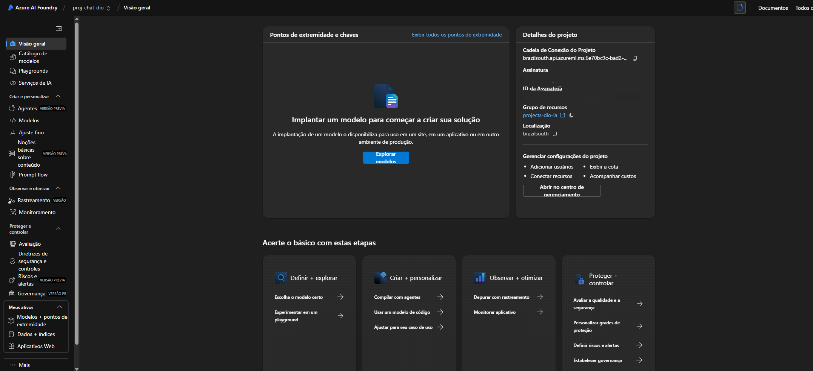

Implantando o modelo de linguagem
<br/>
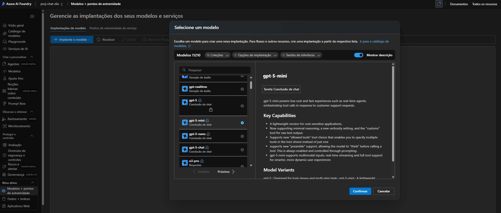

Modelo GPT implantado
<br/>
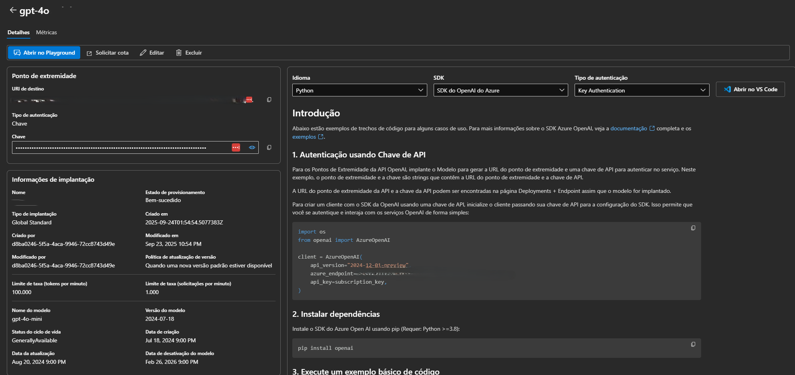

Implantando o modelo de Embeddings (para interpretar os textos dos PDFs)
<br/>
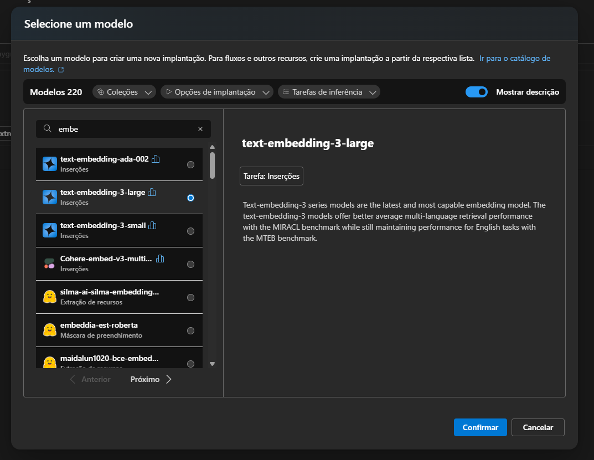

Modelo de Embeddings implantado
<br/>
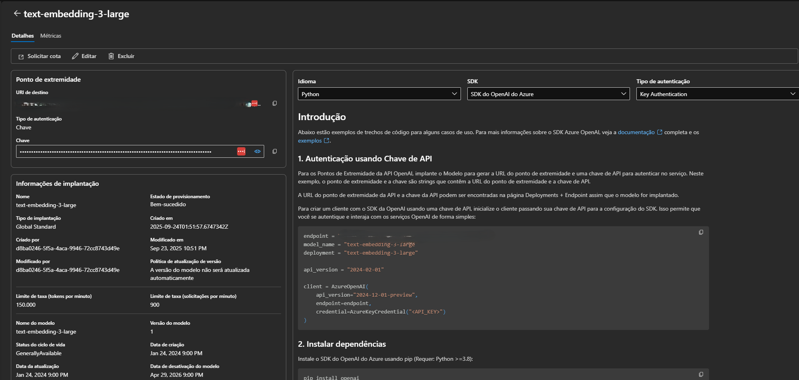

## 7) Testes no Playground (exemplos)
1) Pergunta

```
Como posso proporcionar uma aula melhor e os alunos chegarem com energia para treinar?
```
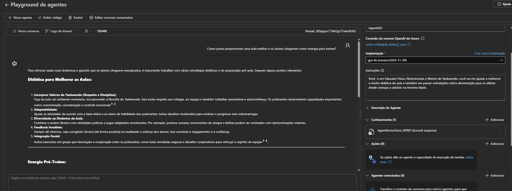
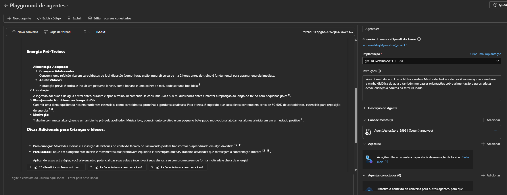
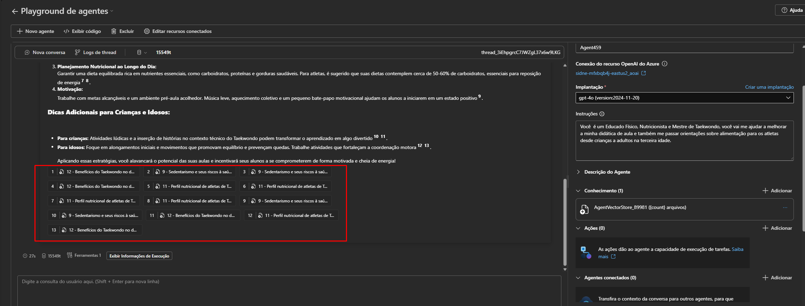

2) Pergunta

```
Sobre a qualidade de vida para quem treina Taekwondo, o que pode melhorar na saúde do praticante?
```
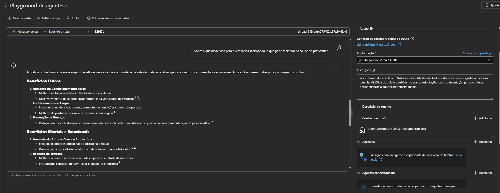
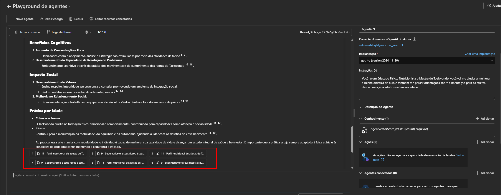

3) Pergunta

```
Explique sobre o conceito do Taekwondo e o impacto social dele.
```
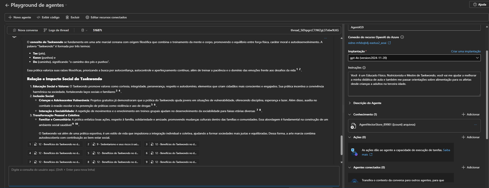

## 8) Dicas de uso (RAG)
- Faça perguntas objetivas e contextualizadas ao seu objetivo.
- Quando necessário, inclua termos exatos do PDF (seções, autores, palavras‑chave).
- Se a resposta vier genérica, reformule pedindo citações ancoradas em trechos do PDF.
- Atualize a base trocando/adição de PDFs e reavalie as respostas.

## 9) Próximos passos
- Avaliar uso de Azure AI Search para indexação e citações mais ricas.
- Criar um front‑end próprio (ex.: Streamlit) para chat com seus dados.
- Adicionar logs/telemetria e testes de qualidade das respostas.

## 10) PDFs do projeto
- `input/1 - The effects of the taekwondo training on children´s strengtyh-agility and body coordiation levels.pdf`
- `input/2 - Taekwondo improves balance in 40-plus.pdf`
- `input/3 - Effect of an adapted Taekwondo-based intervention on functional and motor abilities in elderly care home residents - a study protocol.pdf`
- `input/4 - Effects of taekwondo on health in older people - a systematic review.pdf`
- `input/5 - Effects of taekwondo intervention on cognitive function and academic self-efficacy in children.pdf`
- `input/6 - The effects of taekwondo practice on physical and cognitive variables in children and adolescents - a systematic review.pdf`
- `input/7 - A qualitative investigation of health benefits through a modified Taekwondo activity among nursing home residents.pdf`
- `input/8 - Benefícios do Taekwondo para crianças - uma pesquisa nas academias da cidade de Montividiu- Goiás.pdf`
- `input/9 - Sedentarismo e seus riscos à saúde. Benefícios do Taekwondo para a saúde física e mental.pdf`
- `input/10 - O Taekwon-do na melhor idade e os novos tempos.pdf`
- `input/11 - Perfil nutricional de atletas de Taekwondo em período pré e pós competição.pdf`
- `input/12 - Benefícios do Taekwondo no desenvolvimento social e escolar de menores carentes do bairro Nova Espera.pdf`
- `input/13 - Fatores que motivam a prática do Taekwondo.pdf`

---

Imagens foram intencionalmente exibidas em tamanho reduzido para melhor leitura neste README. Ajuste os atributos `width` se preferir tamanhos diferentes.
